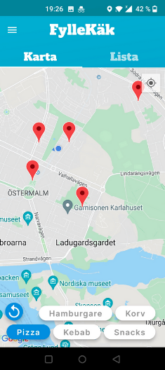
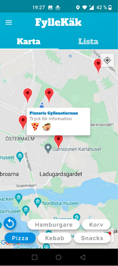
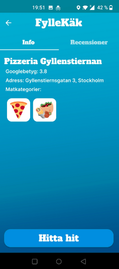
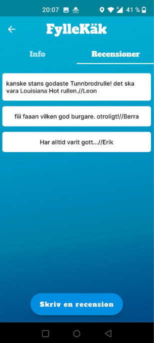
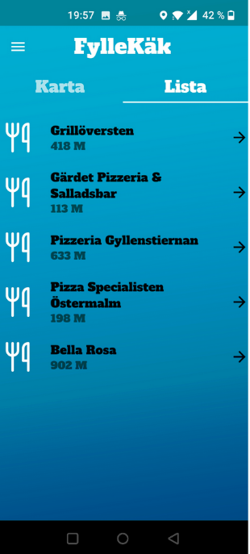
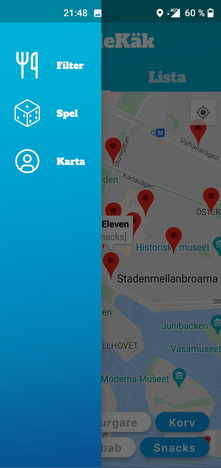

# Mobile app created in dart/flutter. 

The app runs on both Android and iOS.  
The app uses mySQL database and Java Spring as backend to create the API.  
The app uses googles Maps API and nearby places API.  
The restaurant data is initially retrieved from googles restaurants API and then stored locally in a database. 
The restaurants presented to the user are only restaurants that make for a good drunken meal, depending on the users preferences. 

